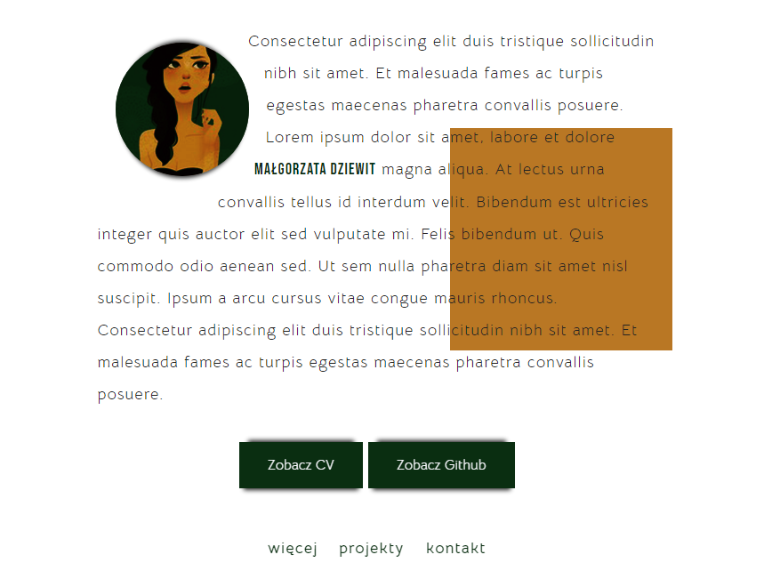

# CodersCamp 2020 - Projekt HTML & CSS

Demo: https://memeraki.github.io/CodersCamp-projekt-indywidualny/

## Projekt HTML & CSS — Wizytówka / Portfolio

Projekt ten prezentuje strone html z informacja o autorze, jego umiejętnościach i portfolio prac. Zawiera równierz formularz i dane kontaktowe.
Projekt korzysta z HTML i CSS oraz preprocesora CSS jakim jest SASS. Zgodnie z założeniem nie ma w nim JavaScriptu ani żadnych frameworków. Preprocesor SASS został użyty w celu ułatwienie sobie pracy przy organizacji samego pliku css. Projekt nie korzysta w pełni z możliwości jakie daje SASS. Jednak możemy w nim znaleźć przykładowe zastosowanie, zmiennych, funkcji, mixinów, zagnieżdżania, importowania plików ze stylami oraz wykorzystanie iteracyjnej pętli for.

Stworzony w programie Visual Studio Code.
Projekt wizualny prezentowanej strony został stworzony przez autora.

Projekt jest ukończony.

##### W projekcie można zobaczyć takie zagadnienia związane z HTML & CSS jak: 
- Box-model
- Kaskadowość CSS
- Selektory CSS
- Popularne tagi HTML
- Jak podpinać CSSa do HTMLa
- Zapisywanie kolorów
- Stylowanie tekstu
- Zewnętrzne ikony/fonty (fontawesome, google fonts)
- Flexbox i/lub CSS Grid
- Position (absolute, relative)
- Animacje keyframes
- Formularz 
- Responsive Web Design
- I więcej...
